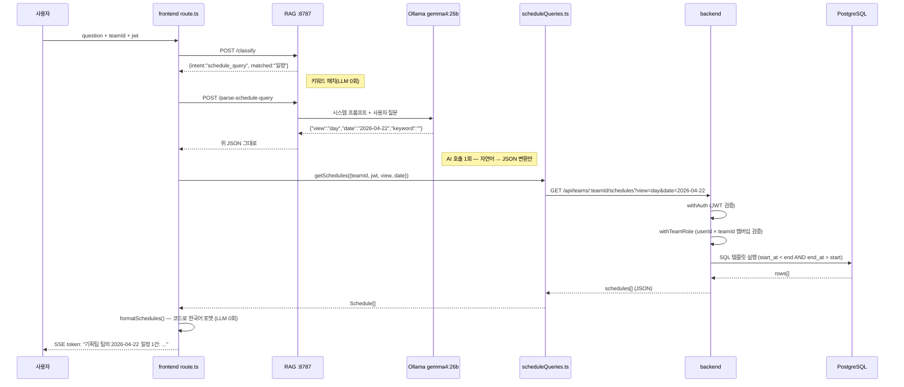
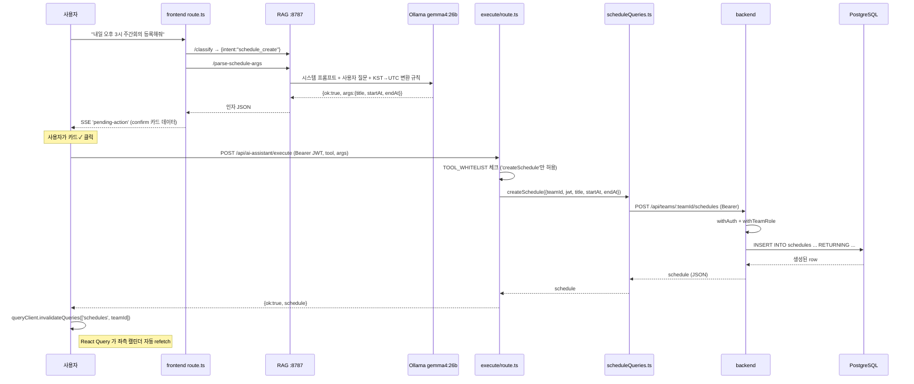

# AI 모델의 DB 접근 흐름 가이드

> AI 어시스턴트(찰떡, gemma4:26b) 가 사용자 자연어 요청을 처리하면서 DB 데이터를 어떻게 다루는지, 어떤 안전장치로 임의 SQL 실행·권한 침해를 방지하는지를 정리한다.
> 관련 문서: [`docs/16-mcp-server-plan.md`](./16-mcp-server-plan.md) (4-way 분기 설계), [`docs/13-RAG-pipeline-guide.md`](./13-RAG-pipeline-guide.md) (RAG), [`docs/14-Open-WebUI-plan.md`](./14-Open-WebUI-plan.md) (웹검색).

## 문서 이력

| 버전 | 날짜 | 내용 |
|------|------|------|
| 1.0 | 2026-04-29 | 최초 작성 — schedule_query / schedule_create 시나리오, 4단계 안전장치, trust boundary 정리 |
| 1.1 | 2026-04-29 | §7 신설 — 다양한 일정 조회 유형(day/week/month/keyword)이 단일 SQL 템플릿 + 파라미터 + frontend 후처리 필터 조합으로 처리됨을 정리. LLM 이 만질 수 있는 영역은 `view/date/keyword` 세 값으로 한정 |

---

## 1. 핵심 원칙

찰떡의 일정 조회·등록 기능은 다음 세 가지 원칙을 따른다.

1. **AI 모델은 DB 에 직접 접근하지 않는다.** AI 의 역할은 자연어를 **JSON 인자**로 변환하는 것까지.
2. **SQL 은 항상 코드가 작성한다.** 검증된 템플릿(`backend/lib/db/queries/scheduleQueries.ts`)만 사용. AI 출력에는 SQL 필드 자체가 없다.
3. **권한·인증은 백엔드 미들웨어 단일 지점.** `withAuth` / `withTeamRole` 가 `userId × teamId` 멤버십을 검증. AI 가 우회할 경로 없음.

> 자유 SQL 생성을 LLM 에 직접 맡기는 방안(A안)은 위험-편익이 맞지 않아 기각됨. 자세한 비교는 `docs/16` §3.

---

## 2. 전체 아키텍처

```
┌─────────────────────────────────────────────────────────────────────┐
│  [사용자]  ──── AIAssistantPanel (React 컴포넌트)                    │
│                       │                                              │
│                       │ POST /api/ai-assistant/chat (SSE)            │
│                       │ body: {question, teamId, jwt, stream}        │
│                       ▼                                              │
│  ┌────────────────────────────────────────────┐                      │
│  │  Next.js API route (frontend)              │                      │
│  │  - classify (intent 4-way 분류)            │                      │
│  │  - parse-schedule-* (자연어 → JSON)        │                      │
│  │  - SSE 이벤트 송출 (token/sources/         │                      │
│  │    pending-action/awaiting-input/done)     │                      │
│  └─────┬─────────────────┬─────────────────┬──┘                      │
│        │                 │                 │                         │
│        ▼                 ▼                 ▼                         │
│  ┌─────────┐       ┌─────────┐       ┌─────────────────────┐         │
│  │ RAG :8787│       │ Open    │       │ frontend/lib/mcp/   │         │
│  │ classify │       │ WebUI   │       │  scheduleQueries.ts │         │
│  │ parse-*  │       │ :8081   │       │  → callBackend()    │         │
│  │ /chat    │       │  (web)  │       └──────────┬──────────┘         │
│  └────┬─────┘       └────┬────┘                  │                    │
│       │                  │                       │ HTTP (Bearer JWT)  │
│       ▼                  ▼                       ▼                    │
│  ┌─────────┐       ┌─────────┐       ┌────────────────────────┐      │
│  │ Ollama  │       │ Searx   │       │ backend Next.js        │      │
│  │ :11434  │       │ NG :8080│       │  /api/teams/:teamId/   │      │
│  │ gemma4: │       └─────────┘       │      schedules         │      │
│  │   26b   │                         │  withAuth + withTeamRole│      │
│  └─────────┘                         │  scheduleQueries (SQL)  │      │
│                                      │       │                  │      │
│                                      │       ▼                  │      │
│                                      │  pg Pool → PostgreSQL    │      │
│                                      └────────────────────────┘      │
└─────────────────────────────────────────────────────────────────────┘
```

핵심: **DB 와 AI 모델 사이에 frontend route → backend → pg pool 의 3-layer trust boundary 가 있다.**

---

## 3. 시나리오 1 — 일정 조회 (`schedule_query`)

입력 예: `"4월 22일 일정 뭐있어?"`

### 3.1 흐름



### 3.2 AI 모델이 보고/만지는 데이터

| 입력 | 출력 |
|------|------|
| 사용자 자연어 한 줄 (`"4월 22일 일정 뭐있어?"`) | 짧은 JSON (`{view, date, keyword}`) |

**AI 는 SQL·DB row·다른 팀 데이터를 일절 보지 않는다.** 결과 포맷팅도 코드(`formatSchedules`)가 담당해 LLM 호출 0회.

---

## 4. 시나리오 2 — 일정 등록 (`schedule_create`)

입력 예: `"내일 오후 3시 주간회의 등록해줘"`

### 4.1 흐름



### 4.2 다중 턴 — 정보 부족 케이스

`"내일 회의 등록해줘"` 처럼 시간/제목이 모호하면:

```
사용자: "내일 회의 등록해줘"
   ↓
parse-schedule-args → {ok:false, needs:"time", hint:"몇 시에 잡을까요?"}
   ↓
SSE token: "몇 시에 잡을까요?"
SSE awaiting-input: {needs:"time", previousQuestion:"내일 회의 등록해줘"}
   ↓
사용자: "오후 3시"
   ↓
AIAssistantPanel.sendQuestion 이 직전 awaitingInput 감지
→ effectiveQuestion = "내일 회의 등록해줘\n그리고 오후 3시"
   ↓
parse-schedule-args 재요청 → {ok:true, args:{...}}
→ confirm 카드 등장
```

서버는 stateless. **conversation 상태는 frontend(messages 배열) 가 보유**. AI 모델은 매 요청마다 합쳐진 question 한 줄을 받아 처리.

---

## 5. 안전장치 (Trust Boundary)

각 위험에 대해 **어느 layer 가 차단**하는지를 명시.

| 위험 | 차단 지점 | 메커니즘 |
|------|----------|----------|
| **AI 가 자유 SQL 생성** | route.ts | `parse-schedule-*` 응답 스키마에 SQL 필드 없음. 코드가 SQL 안 받음 |
| **AI 가 다른 팀 데이터 조회** | frontend session + backend 미들웨어 | `teamId` 는 frontend 의 `selectedTeamId` 에서 fetch body 로 주입. AI 응답에서 받지 않음. backend `withTeamRole` 가 `userId × teamId` 멤버십 검증 |
| **AI 가 임의 도구 호출** | execute/route.ts | `TOOL_WHITELIST = ['createSchedule']`. 다른 이름은 400 거부 |
| **AI 가 잘못된 시각/제목** | confirm 카드 | `pending-action` SSE → 사용자 승인 전엔 INSERT 안 됨 |
| **AI 가 권한 없는 사용자 가장** | backend `withAuth` | JWT 서명·만료 검증. 401 시 frontend 가 "로그인이 만료됐어요" 안내로 변환 |
| **AI 가 다른 사용자의 일정 INSERT** | backend `withTeamRole` + `created_by = userId` | INSERT 시 `created_by` 컬럼은 backend 가 JWT 의 userId 로 강제 설정. AI 가 args 에 다른 userId 넣어도 무시됨 |
| **JSON 파싱 실패 / 깨진 응답** | RAG `/parse-schedule-args` | LLM 응답에서 정규식으로 `{...}` 만 추출. JSON 실패 시 `{ok:false, error}` 반환 → 거절 안내 |
| **classification 오분류** | route.ts unknown 분기 | `intent='unknown'` 시 RAG `/chat` 시도 후 거절형이면 Open WebUI fallback. schedule_* 가 아닌 분기는 DB 호출 자체가 없음 |

---

## 6. AI 모델 호출 시점 정리

찰떡 1회 요청 처리에 AI 모델은 **최대 2회 호출**됨.

| 단계 | LLM 호출 | 입력 | 출력 |
|------|----------|------|------|
| 의도 분류 (`/classify`) | ❌ 0회 — 키워드 매치 | 사용자 질문 | `{intent, matched}` |
| 일정 조회 인자 파싱 (`/parse-schedule-query`) | ✅ 1회 | 자연어 + 현재 KST 날짜 | `{view, date, keyword}` |
| 일정 등록 인자 파싱 (`/parse-schedule-args`) | ✅ 1회 | 자연어 + 현재 UTC 시각 + KST 변환 규칙 | `{ok, args}` 또는 `{ok:false, needs, hint}` |
| 결과 포맷팅 (`formatSchedules`) | ❌ 0회 — 코드 | Schedule[] | 한국어 텍스트 |
| 일정 실행 (createSchedule) | ❌ 0회 — backend SQL | args | DB row |

> 사용법(`usage`) 분기는 RAG `/chat` 1회 호출(LLM 으로 답변 생성). 일반 질문(`general`) 은 Open WebUI 가 1회 호출. **DB 접근 분기는 LLM 을 인자 파싱에만 사용.**

---

## 7. 단일 SQL 템플릿 — 다양한 조회 유형 매핑

일정 조회 의도(`schedule_query`) 는 사용자 질문이 다양하지만, 실제로 DB 에서 실행되는 SQL 은 **하나의 고정된 템플릿** 이다. 변형은 (1) 시간 범위 파라미터, (2) frontend 후처리 필터의 두 단계로만 일어난다.

### 7.1 백엔드 SQL (단일 템플릿)

`backend/lib/db/queries/scheduleQueries.ts:50` 의 `getSchedulesByDateRange`:

```sql
SELECT s.id, s.team_id, s.created_by, u.name AS creator_name,
       s.title, s.description, s.color, s.start_at, s.end_at,
       s.created_at, s.updated_at
FROM schedules s
LEFT JOIN users u ON u.id = s.created_by
WHERE s.team_id = $1
  AND s.start_at < $3
  AND s.end_at > $2
ORDER BY s.start_at ASC
```

파라미터 3개만 받음: `$1=teamId`, `$2=조회 시작 (UTC)`, `$3=조회 종료 (UTC)`. **사용자/AI 입력은 파라미터 바인딩으로만 들어가 SQL 인젝션 불가능.** 모든 일정 조회 의도는 이 한 함수를 호출.

### 7.2 다양한 조회 유형 → 동일 SQL 매핑

| 사용자 질문 | parser 결과 | backend SQL 바인딩 | frontend 후처리 |
|---|---|---|---|
| "오늘 일정" | `view:day, date:오늘, keyword:""` | KST 오늘 00:00 ~ 24:00 의 UTC | - |
| "이번 주 일정" | `view:week, date:오늘` | KST 일요일~토요일의 UTC | - |
| "5월 일정" | `view:month, date:2026-05-01` | KST 6주 grid 의 UTC | - |
| "4월 22일 회의" | `view:day, date:2026-04-22, keyword:"회의"` | KST 4/22 하루의 UTC | `filterByKeyword` |
| "디자인 리뷰 언제야?" | `view:day → month 자동확장, keyword:"디자인 리뷰"` | KST 4월 grid 의 UTC | `filterByKeyword` |

즉 **SQL 1개 + 시간 범위 변형 + (선택) frontend 코드 필터** 의 3단 조합으로 모든 자연어 조회 표현을 흡수한다.

### 7.3 LLM 이 영향 줄 수 있는 영역

```
사용자 자연어
     ↓ AI 호출 1회 (parse-schedule-query)
{view, date, keyword}        ← LLM 이 영향 줄 수 있는 세 값
     ↓ scheduleQueries.getSchedules()
GET /api/teams/.../schedules?view=...&date=...   ← AI 영향 없음
     ↓ backend route.ts:55
getKstDateRange(view, date)  → {start, end}
     ↓ scheduleQueries.ts:50 (위의 SQL)
pg pool.query(SQL, [teamId, start, end])  ← 항상 동일 SQL
     ↓
schedules[]
     ↓ frontend route filterByKeyword(all, keyword)  ← 코드 필터, AI 영향 없음
filtered schedules[]
```

LLM 이 만질 수 있는 건 `view` / `date` / `keyword` 세 값뿐. SQL 구조·컬럼·테이블·JOIN·ORDER BY 는 코드가 고정.

### 7.4 장단점

| 장점 | 단점 |
|------|------|
| SQL 인젝션 불가능 (파라미터 바인딩만) | 변형 어려운 조회는 처리 불가 — 예: "내가 만든 일정만", "5명 이상 참여 일정" |
| 권한 격리 자동 (`team_id = $1` 강제) | 새 조회 패턴 등장하면 backend SQL 추가 필요 |
| 응답 시간 빠름 (LLM hop 1회) | LLM 의 의도 다양성 표현 일부 손실 |
| 결과 가공 정확 (코드로 한국어 포맷) | `filterByKeyword` 는 부분 문자열 매치 — 의미 검색 X |

### 7.5 새 조회 유형 추가 시 변경 지점

예: "내가 만든 일정만 보여줘" 같은 새 패턴을 지원하려면 5개 파일 변경 필요.

1. `backend/lib/db/queries/scheduleQueries.ts` — 새 함수(`getSchedulesByCreator`) + 새 SQL 템플릿 추가
2. `backend/app/api/teams/[teamId]/schedules/route.ts` — GET 핸들러가 query param `creator=me` 받아 분기
3. `frontend/lib/mcp/scheduleQueries.ts` — `getSchedules` 시그니처에 `createdBy?` 옵션 추가
4. `rag/server.js` `/parse-schedule-query` — 시스템 프롬프트에 `createdByMe` 필드 추가
5. `frontend/app/api/ai-assistant/chat/route.ts` — schedule_query 분기가 그 필드 전달

복잡도가 비례적으로 증가하는 게 trade-off. 첫 도입 시 명시적 SQL 작성 비용이 들지만, AI 가 자유 SQL 만드는 위험은 0건.

> 자유로운 조회 표현이 더 중요해지는 시점이 오면 §8 의 표준 PG-MCP 도입 검토. 그 경우 LLM 이 카탈로그 검사 후 SQL 생성, 안전성은 별도 review/whitelist layer 로 보강 필요.

---

## 8. 향후 개선 — 표준 PG-MCP 도입 시 변경 지점

현재는 백엔드 기존 REST API 호출 wrapper. 진짜 표준 PG-MCP 도입을 결정하면 변경 지점은 단 한 곳:

- **`frontend/lib/mcp/pgClient.ts`** 의 `callBackend` 구현부를 MCP stdio client 호출로 교체.
- 인터페이스(`getSchedules`/`createSchedule`)는 그대로 유지 → `route.ts` / `execute/route.ts` 변경 0건.

단, 도입 시 추가 검토 필요:
- Next.js dev turbopack HMR 의 child process leak 방지 (globalThis 캐싱)
- 매 요청 spawn 대신 singleton 유지 (~수백 ms 절감)
- 권한 검증 — backend 미들웨어 우회되므로 system prompt + DB role 분리(read-only vs write user)로 격리 강화 필요

`.mcp.json` 의 `@henkey/postgres-mcp-server` 는 이미 등록되어 있어 인프라 추가 0건.

---

## 9. 데이터 사용 동의·로깅 관점

- **사용자 자연어**는 LLM 컨텍스트로 들어감. 운영 환경에서 외부 LLM(Claude API 등) 사용 시 사용자 동의 필요. 현재는 self-hosted Ollama 라 외부 송신 없음.
- **DB 결과**는 LLM 컨텍스트로 가지 않음 (포맷팅이 코드). 사용자에게만 직접 송출 → 데이터 노출 면적 최소.
- **로그 적재**: backend 가 schedule API 호출 로그 보관. AI 가 어떤 질문을 받았는지/어떤 인자를 만들었는지는 frontend route.ts 가 별도 적재 안 함 (운영 시 추가 검토 필요).

---

## 10. 관련 코드 경로

| 역할 | 경로 |
|------|------|
| 의도 분류 / 인자 파싱 | `rag/server.js` `/classify`, `/parse-schedule-query`, `/parse-schedule-args` |
| 4-way 분기 + SSE | `frontend/app/api/ai-assistant/chat/route.ts` |
| 도구 화이트리스트 + 실행 | `frontend/app/api/ai-assistant/execute/route.ts` |
| backend API wrapper | `frontend/lib/mcp/{pgClient,scheduleQueries}.ts` |
| 백엔드 권한 미들웨어 | `backend/lib/middleware/withAuth.ts`, `withTeamRole.ts` |
| 백엔드 SQL 템플릿 | `backend/lib/db/queries/scheduleQueries.ts` |
| 프론트 UI (confirm 카드, 다중 턴) | `frontend/components/ai-assistant/AIAssistantPanel.tsx` |

## 11. 관련 문서

- [`docs/16-mcp-server-plan.md`](./16-mcp-server-plan.md) — 4-way 의도 분류 + MCP 통합 결정 (B안 채택, A안 기각)
- [`docs/13-RAG-pipeline-guide.md`](./13-RAG-pipeline-guide.md) — RAG 파이프라인
- [`docs/14-Open-WebUI-plan.md`](./14-Open-WebUI-plan.md) — Open WebUI + SearxNG 일반 질문 경로
- [`docs/5-tech-arch-diagram.md`](./5-tech-arch-diagram.md) — 전체 시스템 아키텍처
- [`docs/6-erd.md`](./6-erd.md) — DB 스키마
