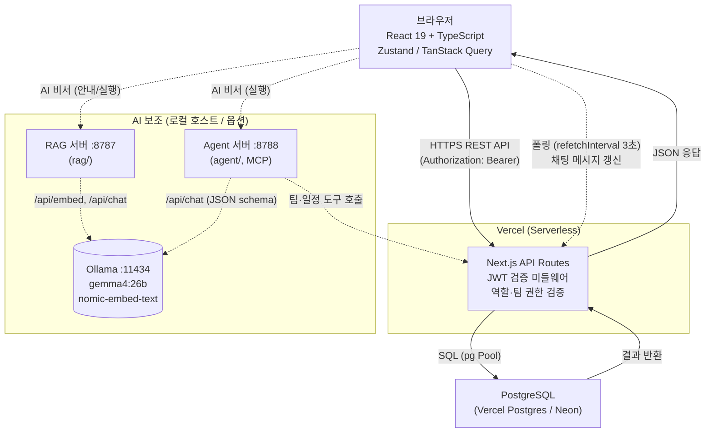
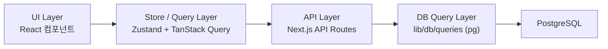
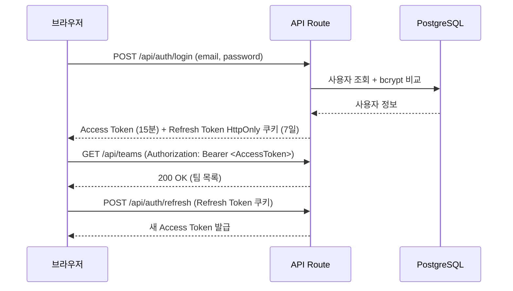
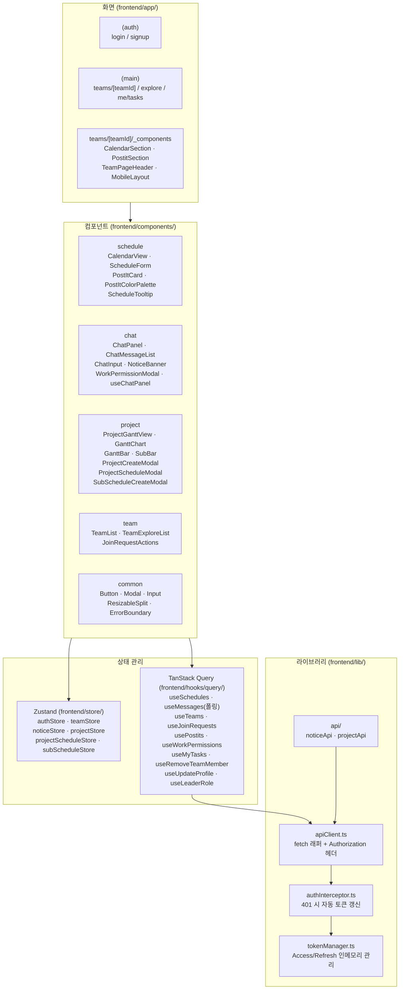
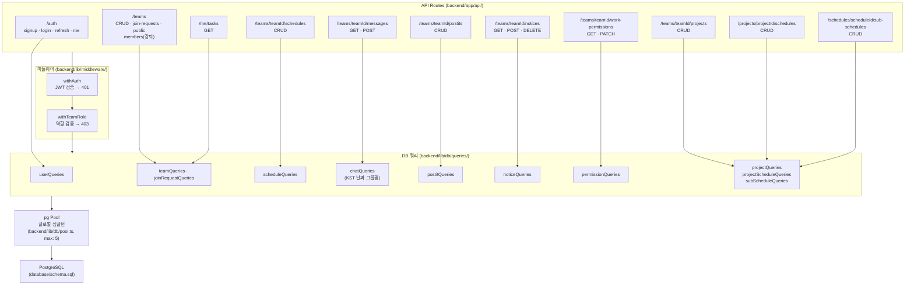
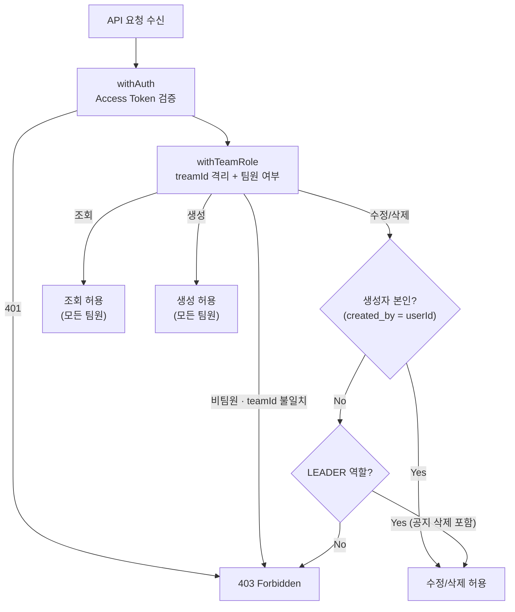
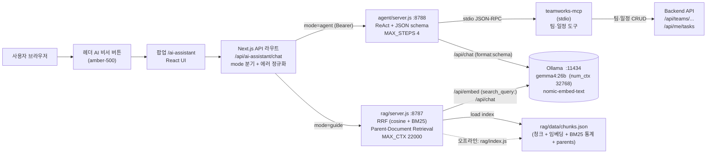

# TEAM WORKS — 기술 아키텍처 다이어그램

## 문서 이력

| 버전 | 날짜 | 변경 내용 |
|------|------|-----------|
| 1.0 | 2026-04-07 | 최초 작성 |
| 1.1 | 2026-04-08 | TeamInvitation → TeamJoinRequest 반영: 다이어그램 4, 5에서 invitations 관련 경로·쿼리 제거, join-requests 반영 |
| 1.2 | 2026-04-09 | 디렉토리 구조 개편 반영: 다이어그램 4, 5 경로를 frontend/ · backend/ 기준으로 갱신 |
| 1.3 | 2026-04-20 | 앱명 Team CalTalk → TEAM WORKS 반영. 신규 기능(포스트잇/공지사항/업무보고 권한/프로젝트 관리) 전체 반영: 다이어그램 4(프론트엔드 컴포넌트·스토어·훅), 다이어그램 5(백엔드 Routes·Queries) 전면 갱신. 다이어그램 6(권한 흐름) 신규 추가 |
| 1.4 | 2026-04-28 | 다이어그램 7(AI 비서 흐름 — RAG·Agent·MCP·Ollama, gemma4:26b) 신규 추가 |

---

## 다이어그램 1 — 전체 시스템 아키텍처

> AI 보조 영역은 별도 호스트의 옵션 컴포넌트. 자세한 흐름은 **다이어그램 7** 참고.

---

## 다이어그램 2 — 레이어 의존성

---

## 다이어그램 3 — 인증 흐름

---

## 다이어그램 4 — 프론트엔드 아키텍처

---

## 다이어그램 5 — 백엔드 아키텍처

---

## 다이어그램 6 — 권한 흐름 (Creator-based + LEADER 특권)

---

## 다이어그램 7 — AI 비서 흐름 (안내·실행 모드)

브라우저 헤더의 AI 비서 아이콘을 누르면 480×720 팝업창(`/ai-assistant`)이 열린다. 팝업은 같은 origin 의 Next.js API 라우트(`app/api/ai-assistant/chat`)를 프록시로 호출하고, 라우트가 `mode` 값에 따라 RAG 서버(안내) 또는 Agent 서버(실행)로 분기한다. 두 서버 모두 같은 호스트의 Ollama(`gemma4:26b` + `nomic-embed-text`)를 공유한다.

흐름 핵심:
- **안내 모드(`mode=guide`)** — `ollama/*.md` 공식 문서를 RAG 로 검색해 참고 자료를 동봉한 답변. 인증 불필요(프록시가 RAG 서버로 그대로 전달).
- **실행 모드(`mode=agent`)** — 사용자 자연어를 JSON 도구 호출로 변환해 백엔드 API 를 실제로 호출. Bearer 토큰 필수(프록시가 헤더 검증).
- **호출 옵션** — `rag/ollamaClient.js` · `agent/ollamaClient.js` 모두 `DEFAULT_CHAT_OPTIONS = { num_ctx: 32768, num_predict: 1024 }` 를 호출 시점에 병합. Modelfile(128K 기본) 은 변경하지 않아 다른 서비스가 같은 모델을 풀 컨텍스트로 호출하면 그쪽은 영향 없음.
- **인덱스 산출물** — `rag/data/chunks.json` 은 `rag/index.js` 가 1회 생성. `ollama/*.md` 가 변경되면 재인덱싱 후 RAG 서버 재기동 필요(`docs/13-RAG-pipeline-guide.md §6.3·§6.4`).

---

## Vercel 제약 요약

- WebSocket / SSE 미지원 — 채팅은 TanStack Query `refetchInterval: 3000` 폴링으로 대체
- Serverless Function 실행 시간 기본 10초 제한 — 복잡한 집계 쿼리 금지, 인덱스 필수
- 로컬 파일 쓰기 불가, DB 연결은 pg Pool 글로벌 싱글턴(max: 5)으로 과부하 방지
